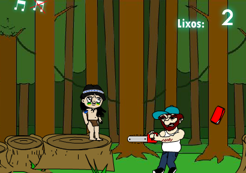
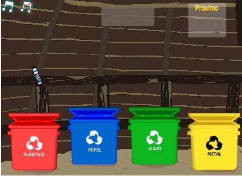
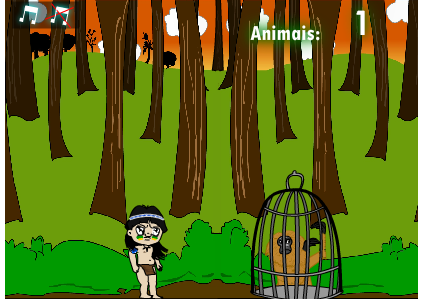
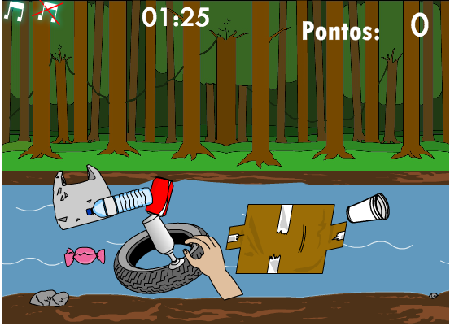
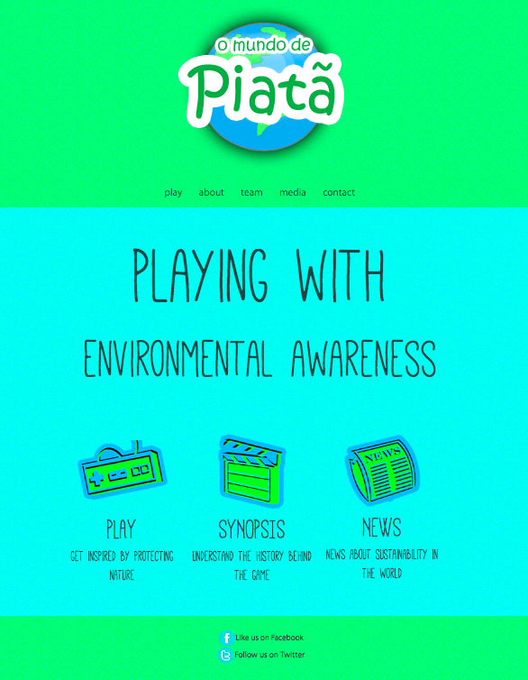

## **Piatas-World-Game**

**Piata's World Game** is a platform game I developed together with two other friends in high school (2010). Piata, the main character is saving the forest by completing each "stage", which represents different environmental issues. Thus, by playing the game, middle-school students can learn about Deforestation, Water Pollution, Animal Trafficking, and Recycling.

To play it, go to: [omundodepiata.com.br/english](www.omundodepiata.com.br/english) and click on "Play" button.

Or directly here: [Play](www.omundodepiata.com.br/english/jogar)
